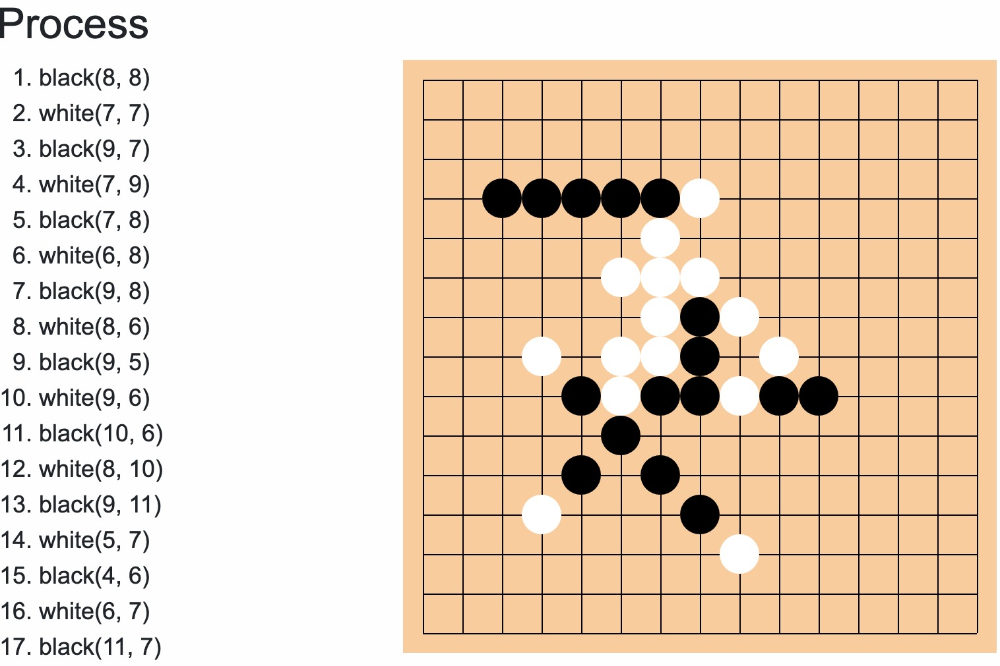
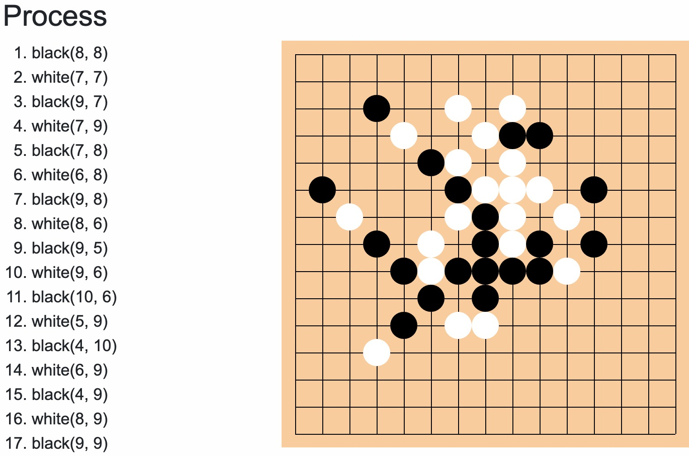
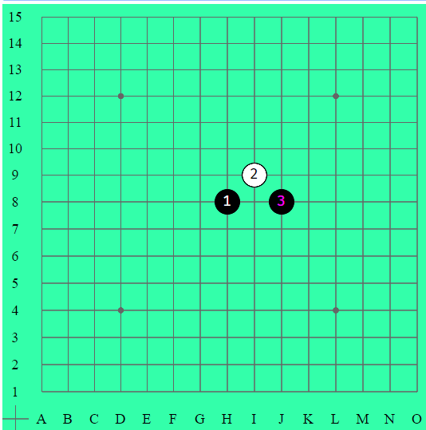
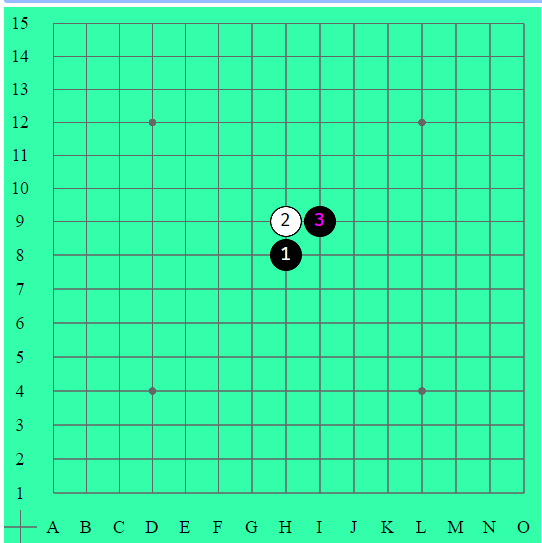

  <h2 align="center">Gobang - Prolog</h2>

  

    A simple gobang bot using prolog
  

 

  
  

---
# 簡單規則
⽤ Prolog 實做五⼦棋的 AI
* 盤⾯ 15 x 15
* ⿊⼦為先⼿，⽩⼦為後⼿
* ⿊⼦有禁⼿：不能雙活三、雙死四、長連（超過五⼦）
* 如果⿊⼦某個禁⼿的落點可以同時達成恰好連五，此時允許落⼦。
* ⼀回合上限 5秒

# 實作筆記

## 1. 基本的搜尋架構

在棋局的前三手，採用的下棋策略為固定的規則:

1. 第一手天元(8,8)
2. 第二手固定下斜指
3. 第三手看第二手落子決定(如圖)

斜指→蒲月開局

直指→花月開局

而在三手後，使用的是minimax search作為主要的搜索演算法，並搭配alpha-beta pruning 幫助提升搜索深度。

## 2. 評估盤⾯的⽅式

評估盤⾯上分成兩種狀況:

1. 已經確定輸贏
    1. 五子(或以上)連線:  99999995
    2. 對手有4，且剩下空位不為禁手: -99999995
    3. 1-2不成立，同時有活四或雙死四: 99999995
    4. 黑子落在禁手位置: -99999995
2. 勝負未明， 把盤面上連子評分加總。評分的標準主要根據距離必勝並敗局面所需的步數決定。同時因為評分發生在己方下完棋後，所以擁有同樣pattern時，對手的威脅較大，評分提升一個層級。
    1. 對方活三: 10000
    2. 己方死四: 1000
    3. 己方活三: 1000
    4. 對方普通三: 1000
    5. 己方普通三: 100
    6. 對方連二: 100
    7. 己方連二: 10

## 3. 速度優化

### Memoization

為了加速判斷各種棋盤上連子的狀態，使用prolog內建的table紀錄兩種predicate:

1. adjacentTo : 代表所有和已存在棋子相鄰的位置
2. relativeTo: 代表所有和已存在棋子相關的位置(可能形成連線，在米字形上座標+-4區間內)

adjacentTo和relativeTo在tabling前後，整體速度提升約4%

另外為了加速判斷落子點是否為禁手，同樣建立快取紀錄，但跟前兩項不同之處在於，是否構成禁手會受棋局變化影響，所以需要動態的調整內容。具體作法需要兩個dynamic predicate: cached_V和cached_NV紀錄座標是否為禁手，同時在每次從棋盤上新增或移除棋子時，更新改變點相關的座標(參考上述relativeTo定義)。

判斷禁手在建立快取前後，整體速度提升約4%

### 選擇可能的落子點

在進行minmax搜索前，首先要先決定那些位置是值得嘗試和搜索的，並且粗略根據好棋的可能性排序以利剪枝。
在這裡程式把所有可能的落子分成五個層級，依照重要程度決定是否嘗試和嘗試順序。在同樣層級中，攻擊又優先於防守(比如兩方都連四缺一，則由當前回合的人勝利)。

1. 潛在五子缺一的缺口
2. 潛在五子缺二的缺口
3. 潛在五子缺三的缺口
4. 所有和已存在棋子相鄰的空位
5. 所有和已存在棋子相關的空位(可能形成連線，在米字形上座標+-4區間內)

在經過測試後可以得到以下幾點結論:

1. 層級1到4間，對局勢造成威脅相差很大。大部分時候存在高層級的缺口時，不必要考慮落子低層級缺口(特例見3 )。每次只要考慮最高順位的缺口，可以有效減少搜索樹的寬度。
2. 層級4和層級5，對局勢造成威脅相差不大，但其數量遠大於1,2,3所造成的，特別是層級5。所以在一般狀況不考慮層級5
3. 1.的特例發生在，第一層的缺口皆是禁手，這時理應把第二層也納入考量。但是由於判斷禁手所費時間成本較大，不宜在這個階段判斷，加上考量到一般狀況下，第一層缺口數量不超過兩個(否則進入必勝必敗局面)。所以折衷辦法是，將一二層合為一層，而在這個階段只考量是否為空位，不考慮缺口是否為禁手。

到搜索階段才判斷禁手對比在選擇落子點前判斷禁手，整體速度提升約16.5%

### 提前終止搜索

有三種情況下，演算法會停止往更深的層數搜索:

1. 到達預設最深層數
2. 已經獲勝或達到剪枝條件
3. 費時接近5秒

透過觀察程式和自己對弈，落子所費時間可以發現。以深度7層為例，普通殘局因為攸關勝負的缺口少和容易觸發剪枝，花費時間中位數大概在4秒。但在靠近終局，尤其是面臨必敗局面的時候，最多花了12.8秒左右才完成搜索。

我透過prolog內建的statistics\2計算程式運行費時，在逼近時間上限時阻止更進一步的搜索並回傳當下的local maximum，確保搜索不會超時。同時因為時間上限被終止的答案未必是最佳解，所以策略上應該要調整層數盡量使得只有必敗棋局被修剪，而正常棋局可以充分利用時間。

## 4. 其他⼼得

### 已知問題:

### 1. 禁手規則造成評估盤面時，高估黑子優勢

因為在這次的禁手規則中，不存在已禁解禁的問題，所以在雙活三雙死四的implementation中自然就不考慮缺口是否為禁手。但是這個做法卻會造成黑子高估自己的價值，比如說在搜索深度還沒到終局前，黑子目前認為的好棋，未來可能因為禁手而不成立。解決方法可能需要為黑子另外做一種評分標準，引導黑子用禁手規則下可行的方式勝利(比如透過VCF或VCT爭取活三死四)。

### 2. 選擇落子點的方式對於防守連子數少的pattern不夠積極

選擇落子點的排序方式沒有辦法確切代表實際對棋局的威脅程度。比如說防守死三的重要程度應該沒有差一子形成雙活三的雙活二重要。

### 效果不顯著的嘗試

### 1.選擇落子點的方式對於防守連子數少的pattern不夠積極

承上述，在發現這點後，我有試著完善選擇落子點的規則，但是要提前在這個階段判斷比如"差一子形成雙活三"等等規則，花費時間成本過長，在同樣層數下費時大約是舊方法的3倍。在沒有想到好方法優化的情況下，最後選擇放棄。

### 2.透過Zobrist Hashing快取棋局對應評分

本來的構想是將每一個顏色對應座標的組合( $2\times15^2$)分配一個在$\{0 \dotsc  2^{64}-1\}$間的隨機數字，將所有落子代表的數字做xor運算，以此代表當前棋局。接著就可以建立一份以當前棋局對應到局勢評分的hash map。如果是預先跑好所有殘局評分，不到20步內檔案就會到Gigabyte的尺度，大小上不可行，以64bit作為hashing的範圍標準會有collision發生。

所以比較合理的作法應該是在搜索過程中才把評分過的棋局建立快取。但是在實驗過後發現，在搜索過程中遇到重複殘局的機率太低，以深度6的一局程式自己對下為例，使用快取最多的一次是6次，而同時當下搜索的節點數有201個。同時記錄快取對於每一次評估分數大約會增加60多個inferences，整體而言反而是拖慢速度。